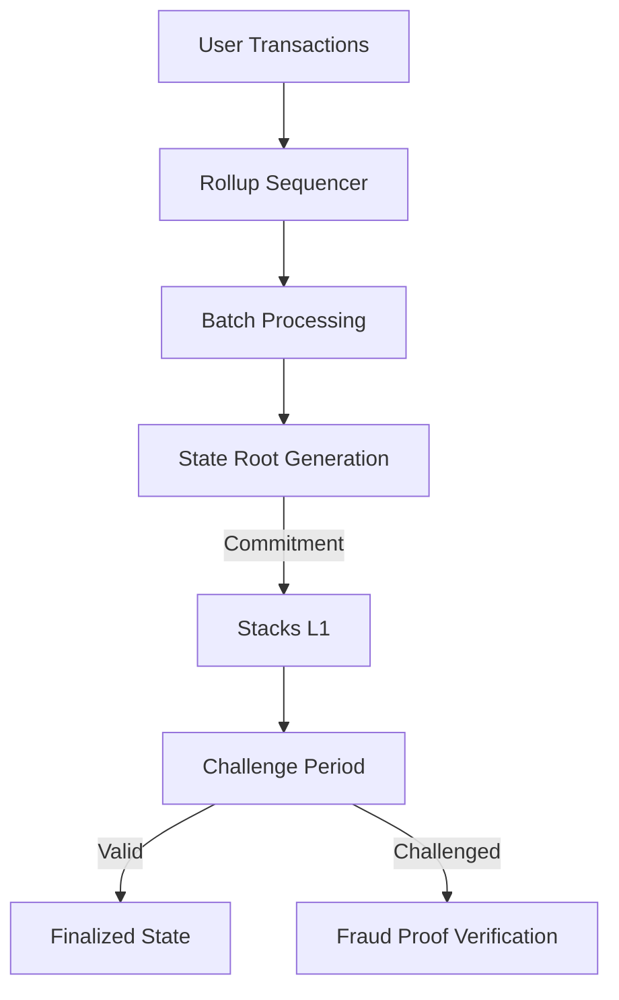

# BitcoinOrbit - Scalable Layer 2 Rollup Protocol for Stacks

BitcoinOrbit is a cutting-edge Layer 2 scaling solution implementing an optimistic rollup mechanism designed for the Stacks blockchain. Our protocol enables high-throughput Bitcoin-compliant transactions while maintaining strong security guarantees through cryptographic commitments and a decentralized challenge system.

## Key Features

- **Optimistic Rollup Architecture**  
  Batch process thousands of transactions off-chain with periodic on-chain state commitments

- **Trustless Bridging**  
  Secure deposit/withdrawal mechanisms with Merkle proof verification

- **Enterprise-Grade Throughput**  
  Achieve 100-1000x Bitcoin base layer transaction capacity

- **Decentralized Security**  
  Robust operator/challenger ecosystem with economic incentives

- **Native Asset Support**  
  Multi-token system with ERC-20 style token management

## Technical Architecture

### Core Components:
1. **State Commitments**  
   Operators submit compressed state roots to Stacks L1
2. **Fraud Proofs**  
   7-day challenge period for invalid state transitions
3. **Data Availability**  
   All transaction data stored in IPFS with on-chain references
4. **STX Bonding**  
   Economic security through operator/challenger bonds



## Getting Started

### Prerequisites
- Node.js v18+
- Clarinet
- Stacks.js SDK

### Installation
```bash
git clone https://github.com/bitcoinorbit/core.git
cd core
npm install
clarinet console
```

## Usage Guide

### Operator Registration
```clarity
(register-operator)
// Requires contract owner privileges
```

### Submit State Commitment
```clarity
(submit-state-commitment 
  u123 
  0xdeadb33f 
  u500 
  u10000 
  0x2987c3a1)
// Operator submits batch with 500 transactions
```

### User Deposit
```clarity
(deposit u500 u1)  // Deposit 500 units of token ID 1
```

### Cross-Rollup Transfer
```clarity
(transfer-in-rollup 
  'SZ2J6ZY48GV1EZ5V2V5RB9MP66SW86PYKKQ9H6DPR 
  'SM3J6ZY48GV1EZ5V2V5RB9MP66SW86PYKKQV2V5RB 
  u100 
  u1)
```

### Withdrawal Process
```clarity
(withdraw 
  u200 
  u1 
  0x8923a1c6...)
// With 256-byte Merkle proof
```

## Security Model

### Economic Guarantees
| Role                | Bond Amount | Slash Condition           |
|---------------------|-------------|---------------------------|
| Operator            | 1000 STX    | Invalid state commitment  |
| Challenger          | 500 STX     | False challenge           |

## Contributing

We welcome contributions through:
1. Protocol improvements (RFC process)
2. Smart contract enhancements
3. Client implementations
4. Security audits

*BitcoinOrbit: Scaling Bitcoin's Potential to Orbit and Beyond* 🚀